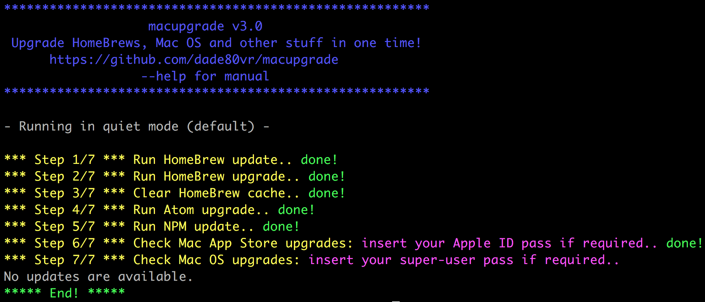

# macupgrade 
Upgrade HomeBrews, Mac OS and other stuff in one time!



## Features

Designed for Apple Mac, this Bash script performs an owner check/mod of _/usr/local_ folder (to permit to any users to run HomeBrew update/upgrade without folder ownership errors), run HomeBrew + Cask update/upgrade/cleanup, run Atom upgrade, NPM update and finally run MAS & Mac OS upgrades.

### MAIN requirements

* [Git](https://git-scm.com/download/mac)
* [awk](http://macappstore.org/gawk)

### SUB requirements (not needed but useful)

* [HomeBrew](https://brew.sh)
* [Atom](https://atom.io)
* [npm](https://www.npmjs.com)
* [MAS](https://github.com/mas-cli/mas)

### Installation

```shell
git clone https://github.com/dade80vr/macupgrade.git
```

### Make it executable

```shell
cd macupgrade
chmod +x macupgrade.sh
```

### Usage

`./macupgrade.sh` (with no arguments) run in quiet mode (default)

`--help` show help

`-v` verbose mode, show output from any script (default hide)

`-m` monochrome output

### `April 2020 update:` NPM error fixed 

### `January 2020 update:` NPM update error needs investigation

Version 3.4 hit an error when running `npm update -gq` so the update was been temporaly disabled for investigation.

```
npm ERR! code EEXIST
npm ERR! syscall symlink
npm ERR! path ../../../lib/node_modules/npm/man/man1/npm-adduser.1
npm ERR! dest /usr/local/share/man/man1/npm-adduser.1
npm ERR! errno -17
npm ERR! EEXIST: file already exists, symlink '../../../lib/node_modules/npm/man/man1/npm-adduser.1' -> '/usr/local/share/man/man1/npm-adduser.1'
npm ERR! File exists: /usr/local/share/man/man1/npm-adduser.1
npm ERR! Remove the existing file and try again, or run npm
npm ERR! with --force to overwrite files recklessly.
```

Plese wait for next update or help me to find the problem :)

### `March 2018 update:` Warnings or errors messages regarding MAS

If you got warnings or errors @ steps 2-3 (HomeBrew MAS upgrade) regarding installation of Xcode 9.0 please remove `mas` and reinstall it from `mas-cli/tap/mas`:

```shell
brew uninstall mas
brew install mas-cli/tap/mas
```

Se this issue for major details:
https://github.com/mas-cli/mas/issues/138

### License

Code is under the [MIT license](LICENSE).

---

### Want to uninstall?

```shell
rm -rf macupgrade
```
